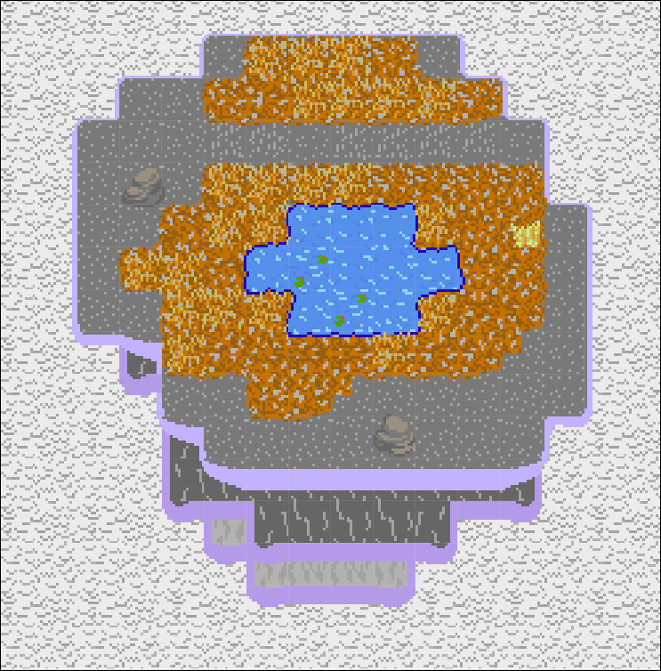
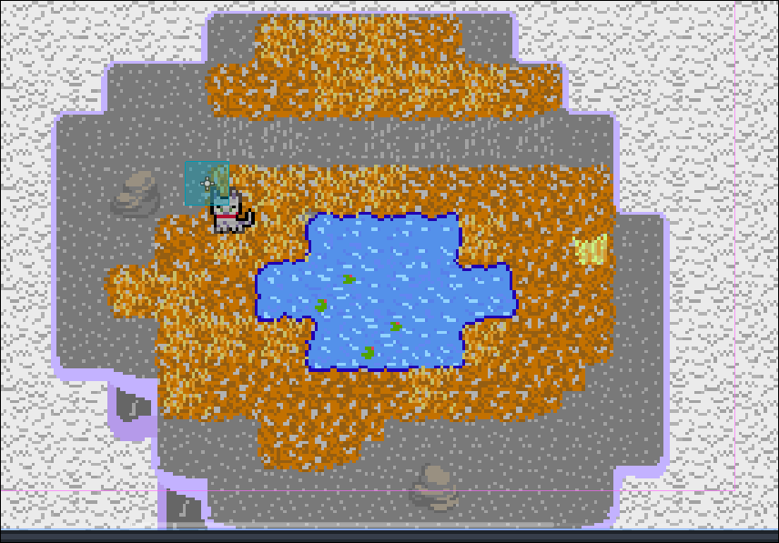

# 1/1/2025
(This is commited the day after, sorry I forgot to yesterday)
- Worked on my game. Drew lots of nice tiles and made a test map! Have no code yet tho.
- I've finished probably about half the tiles, and not including the decor. I'll finish the tiles later and work on the decor now so I can start coding soon.
- My time tracking tool says I have spent 4 hours 53 min and 28 sec so far making assets (this doesn't include making the level, which I have no tracking method for). I hope this counts...

# 2/1/25
- Made the ldtk map auto export for usage soon
- Added a `main.py` with almost nothing in it

# 3/1/25
- Added a player picture!
- Started working on the game in python. Got pretty far, with a total of 2hr 45min so far (including the small amount of time writing this docs and the slightly larger amoutn working on the data.json file). Then realised I couldn't use Python and started working in Godot.
- Got a moving player and scrolling background!
- Realised that the past 4-5 hours of work was not logged due to wakatime issues in Godot (never used it before) (I'm mad because it never said anything!)

# 4/1/25
- Fixed collisions
- Added the first collectable - an apple with an apple tree!
- Made the map stuff its own node to be easier to use more
